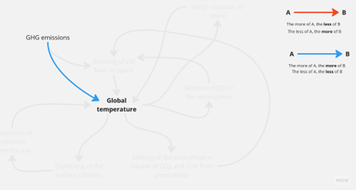
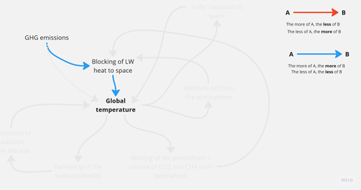
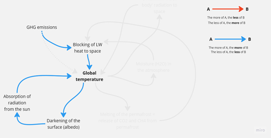
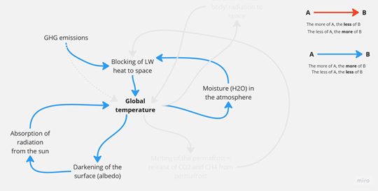
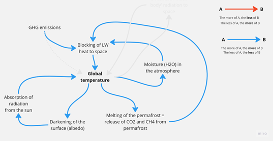
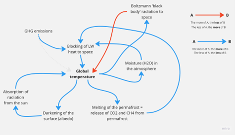

# Emissionen und Temperatur

Eine Frage taucht immer wieder auf: Warum bleibt die Temperatur so hoch, obwohl die Emissionen so stark gesunken sind?
Die Frage und die Verwunderung rühren von einem unvollständigen Denkmodell her. Die meisten von uns haben gelernt, dass es die Treibhausgasemissionen sind, die höhere Temperaturen verursachen. Dieses Denkmodell von Ursache und Wirkung ist mittlerweile so tief verankert, dass wir mit aller Kraft dafür kämpfen, **Netto-Null** zu erreichen.

  
Die physikalische Realität ist jedoch etwas komplexer. Erstens verursachen die Treibhausgase höhere Temperaturen, indem sie Wärme absorbieren, die sonst ins Weltall entweichen würde, d. h. sie verhindern, dass ein Teil der Wärme (technisch gesehen Teile der langwelligen (LW) Strahlung) entweicht. Diese Unterscheidung wird später entscheidend.

  
Na und, wirst du vielleicht sagen. OK, die Kausalität verläuft über eine Zwischenvariable, aber dennoch: weniger Treibhausgasemissionen, weniger Blockierung, weniger Temperatur – alle Pfeile sind blau.

## Der Albedo-Kreislauf
Das stimmt, aber die Temperatur ist in ein größeres physikalisches System eingebettet. Erstens verdunkelt eine höhere Temperatur den Planeten, hauptsächlich durch das Schmelzen von Eis auf Ozeanen und an Land. Ein dunklerer Planet absorbiert mehr kurzwellige Strahlung von der Sonne und erhöht so die Temperatur. Dies wird als [**Albedo**-Rückkopplung](https://en.wikipedia.org/wiki/Ice%E2%80%93albedo_feedback)
bezeichnet. Eine erste sich selbst verstärkende Rückkopplungsschleife (alle Pfeile sind blau), die unabhängig von jeglichen Treibhausgasemissionen wirkt!

 
## Die Feuchtigkeitsschleife
Zweitens führen höhere Temperaturen dazu, dass die Atmosphäre mehr Feuchtigkeit aufnehmen kann. Feuchtigkeit ist H₂O, ein sehr wirksames Gas, das den Abfluss von mehr langwelliger Strahlung ins All verhindert und die Temperatur noch weiter erhöht. Ein zweiter sich selbst verstärkender Rückkopplungskreislauf (alle Pfeile sind blau), der unabhängig von jeglichen Treibhausgasemissionen wirkt! Mehr dazu findest du hier: [Die Wasserdampf-Rückkopplung](https://science.nasa.gov/earth/climate-change/steamy-relationships-how-atmospheric-water-vapor-amplifies-earths-greenhouse-effect/)

## Der Permafrost-Schmelz-Kreislauf
Drittens führen höhere Temperaturen dazu, dass mehr Permafrost schmilzt. Da Permafrost ein riesiger Speicher (~ 1500 Gigatonnen) für CH4 und CO2 ist, wird dieses Gas im Laufe der Zeit in die Atmosphäre freigesetzt, wodurch noch mehr langwellige Strahlung am Entweichen ins All gehindert wird, was die Temperatur noch weiter erhöht. Ein dritter sich selbst verstärkender Rückkopplungskreislauf (alle Pfeile sind blau), der unabhängig von jeglichen Treibhausgasemissionen wirkt! Schau dir den [Permafrost-Rückkopplungskreislauf an](https://www.esa.int/Applications/Observing_the_Earth/FutureEO/Permafrost_thaw_it_s_complicated).

 
Die drei hier skizzierten Kreisläufe sind in Wirklichkeit komplizierter, insbesondere der Feuchtigkeitskreislauf, da er Wolken beinhaltet, über die wir bisher nur sehr wenig wissen, aber die oben dargestellte Kausalität trifft zu. Selbst wenn wir also schneller als gedacht das Netto-Null Ziel erreichen, gibt es starke Rückkopplungen, die unseren Planeten wärmer halten, als er es seit sehr, sehr, sehr langer Zeit war. 

## Wir leben in einer anderen Welt, Baby!
Warum? Das Klimasystem ist heute nicht mehr das, was es vor 200 Jahren vor der industriellen Revolution war. Die unerbittliche Emission von Treibhausgasen über 200 Jahre hinweg hat ein anderes System geschaffen, in dem andere Rückkopplungskausalitäten das Verhalten des Systems bestimmen. Eine Analogie wäre die eines Alkoholikers. Nach einem Leben voller exzessiven Alkoholkonsums ist sein Körper physiologisch nicht mehr das, was er war, bevor er den ersten Drink zu sich nahm. Finanzanalysten nennen das einen Regimewechsel. Alkoholiker nennen das Sucht.

Ist es also zu spät? Da sich alle Kreisläufe selbst verstärken? Und die Teufelskreise mit jeder Runde, die sie durchlaufen, noch verstärken?

## Der Schwarzkörperstrahlungs-Kreislauf
Nicht wirklich, denn es gibt einen mächtigen **ausgleichenden** Kreislauf – wieder völlig unabhängig davon, was wir Menschen tun oder lassen – reine Physik: [Der Stefan-Boltzmann-Schwarzkörperstrahlungs-](https://en.wikipedia.org/wiki/Stefan%E2%80%93Boltzmann_law). Der Planet Erde ist, was die Strahlungsenergie angeht, ein Schwarzkörper. Und Schwarzkörper strahlen Wärme nach außen ab (im Falle unseres Planeten in den Weltraum), und zwar nicht nur proportional zu ihrer Temperatur, sondern proportional zur **vierten Potenz** ihrer Temperatur. Daher lohnt es sich auf jeden Fall, alles zu tun, was wir Menschen tun können, um diese Rückkopplung zu unterstützen.

 
Wenn du dies **nicht** auf Englisch siehst und die Wörter in den Bildern in deine Sprache übersetzen möchtest, kannst du das gerne tun. Schick uns das Ergebnis als *.png-Datei an [simfuture@blue-way.net](mailto:simfuture@blue-way.net). Wir werden deine Arbeit würdigen!
