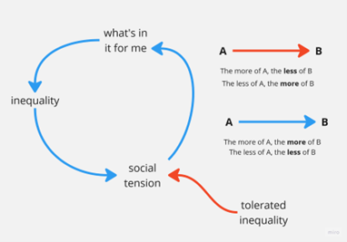

# Ungleichheit und soziale Spannungen

Zunehmende Ungleichheit führt zu sozialen Spannungen. In welchem Ausmaß und wie schnell dies geschieht, ist je nach Zeit und Kultur unterschiedlich. Daher die Variable *tolerierte Ungleichheit*. Aber letztendlich lässt sich nicht leugnen, dass [Ungleichheit zu sozialen Spannungen führt](https://www.bosch-stiftung.de/de/storys/dimensionen-ursachen-und-folgen-von-ungleichheit) - und [hier](https://www.wsi.de/data/wsimit_2018_05_groh-samberg.pdf). Die ganze Palette an solzialen Ungleichheiten findest du [hier](https://soztheo.de/soziologie/allgemeine-soziologie/soziale-ungleichheit/)

In solchen Situationen ist es eine ganz normale Reaktion für jeden Einzelnen oder jede Gruppe in der Gesellschaft, nur auf sich selbst zu achten. Die Suche nach Antworten auf die Frage **Was springt für mich dabei heraus?** führt zu mehr Ungleichheit, schürt noch mehr soziale Spannungen, und so weiter und so fort. Es gibt viele umgangssprachliche Ausdrücke, um eine solche Abwärtsspirale zu beschreiben. Angefangen beim harmlosen *Wenn es regnet, gießt es* bis hin zu *[Das ist kein technologischer Zusammenbruch, das ist der Weg zur Hölle](https://www.youtube.com/watch?v=OcW-BSEB3ng)*. 

Teufelskreisläufe verfügen aus eigener Kraft nicht über die Mittel, um aus ihren Kreislauf aus zu brechen. Diese Energie muss von außen kommen: von etwas oder jemandem, der gegen die Ungleichheit ankämpft. Von jemandem oder etwas, das ein Ziel oder eine Vision vermittelt, die größer ist als die einzelner Partikularinteressen. Es gibt Situationen, in denen nichts davon geschieht. Das führt zum Zusammenbruch und bestenfalls zu einem „[Wiederaufbau aus purer Erschöpfung](https://www.goodreads.com/book/show/6034091)“. 
 

Wenn du feststellst, dass deine Spieler:innen über diesen Rückkopplungsprozess sprechen oder versuchen, ihn zu verstehen, bitte sie um persönliche Beispiele, in denen sie selbst in einer solchen Schleife waren oder andere dabei beobachtet haben. Frage auch nach Beispielen aus Romanen oder Filmen - das ist oft einfacher, als über persönliche Erlebnisse zu sprechen. Frage sie auch nach Beispielen für Eingriffe von außen, um die abwärtsgerichtete Kausalität dieser Schleife zu durchbrechen; was ist passiert? Wer griff ein? 

Frage sie, ob ihnen eine soziale Situation mit *zu wenig Ungleichheit* einfällt, d. h. **zu viel Gleichheit**.

Wenn du dies **nicht** auf Englisch siehst und die Wörter in den Bildern in deine Sprache übersetzen möchtest, kannst du das gerne tun. Schick uns das Ergebnis als *.png-Datei an [simfuture@blue-way.net](mailto:simfuture@blue-way.net). Wir werden deine Arbeit würdigen!
