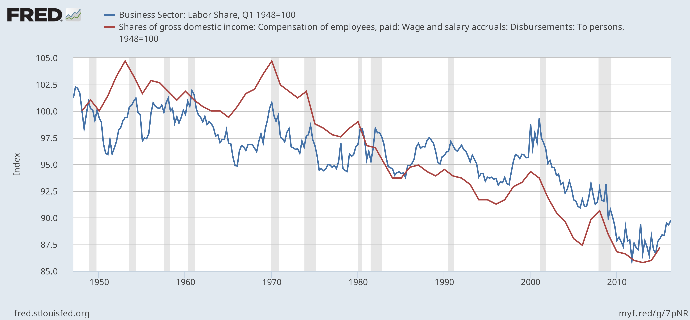
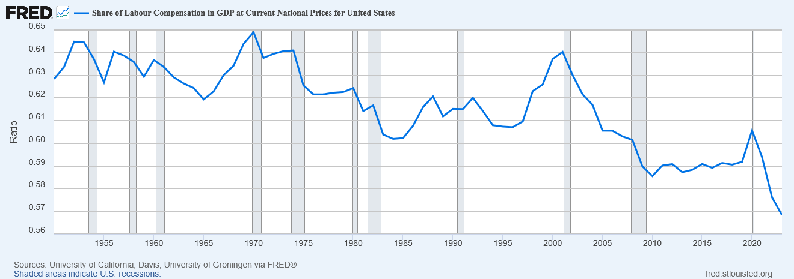

# Gewerkschaften stärken

In jeder Volkswirtschaft wird das Nationaleinkommen zwischen Eigentümer:innen und Arbeitnehmer:innen aufgeteilt. Diese Aufteilung erfolgt durch Verhandlungen zwischen beiden Seiten. Schau dir mal den Anteil an, der in den USA an die Arbeitnehmer:innen (= Arbeit) geht. Seit 1948 ist dieser Anteil immer weiter gesunken. 
 
Die [Quelle dieses Bildes findest du hier:](https://en.wikipedia.org/wiki/Labor_share)
. 
Derzeit liegt er hier:

 
In anderen Ländern sieht die Situation ähnlich aus. Was sagt dir die Grafik?

Du kannst den Arbeitnehmer:innen (= denen, die kaum von Gehaltsscheck zu Gehaltsscheck leben) unter die Arme greifen: Erstens kannst du Gewerkschaften und das Gewerkschaftsrecht stärken. Das verschafft den Arbeitnehmer:innen einen größeren Anteil am Nationaleinkommen. 

Die von dir festgelegte Politik ist eine prozentuale *Erhöhung* des Anteils. 0 lässt alles so, wie es ist, du änderst nichts. 1 erhöht den Anteil um 1 %, 2 um 2 % und 3 um 3 %. Das klingt vielleicht nicht nach viel, aber wenn du den Anteil der Arbeitnehmer von 50 % auf 51 % erhöhst (was einer Steigerung von 2 % entspricht), hast du gleichzeitig den Anteil der Eigentümer:innen von 50 % auf 49 % verringert. Du hast begonnen, das Gleichgewicht zu verschieben.

Siehe auch [Reaktion der Arbeitnehmer](worker-reaction.md)
