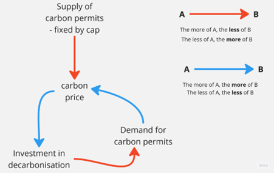
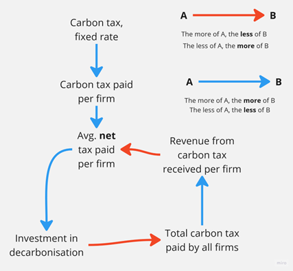

# Carbon tax vs. cap-and-trade example

This short example for policy implications from systems thinking I saw in a [video lecture](https://www.youtube.com/watch?v=QT1UBrHIB2I) given by Simon Sharpe.

Imagine you are given the policy task to reduce carbon emissions in your country and you can either introduce a carbon permit trading scheme (trade) or a carbon tax on emissions, the revenue of which is distributed back to all emitters (tax). Which one should you choose?

In an [article written by WRI](https://www.wri.org/insights/carbon-tax-vs-cap-and-trade-whats-better-policy-cut-emissions), admittedly in 2016, Noah Kaufmann says: *Carbon taxes and cap-and-trade programs share several major advantages over alternative policies. Both reduce emissions by encouraging the lowest-cost emissions reductions, and they do so without anyone needing to know beforehand when and where these emissions reductions will occur. Both policies encourage investors and entrepreneurs to develop new low-carbon technologies. And both policies generate government revenue (assuming emissions allowances are auctioned under cap-and-trade) that can be used in productive ways.*

And sums up: *For sure, there are additional advantages and drawbacks to carbon taxes and cap-and-trade that we have not addressed.* Still, in the words of Jean Tirole, the 2014 winner of the Nobel Prize in economics, these details are *of second order importance* compared to addressing the risks of climate change.

So, it doesn’t matter what you choose? Well, let’s look at the systemic, dynamic implications of your choice.

### Cap and trade

In cap and trade someone, usually the government, sets the supply of permits. The higher the supply, the lower the price (the red arrow below). Also note, the lower the supply, the higher the price; the causality is opposite.

The higher the price, the more investment in decarbonization (the blue arrow which signals causality in the same direction). The more investment, the less demand for permits; the less demand for permits, the lower price: a balancing loop. Or, put more colloquially, if I do the right thing, I **reduce** the incentives for anyone else to do the right thing.
 

### Carbon tax

With a carbon tax, someone, usually the government, sets the rate of tax (per unit of emission). The higher the tax rate, the higher the carbon tax paid by a firm. The higher the tax paid, the higher the net tax paid. The higher the net tax paid, the more investment in decarbonization. The more investment, the lower the total tax paid by all firms. The lower the total, the lower the reimbursement from the carbon tax to an individual firm. The lower the reimbursement, the higher the net tax paid. The higher the net tax paid, the more investment in decarbonization: A self-reinforcing loop, or, more colloquially, if I do the right thing, I **increase** the incentives for anyone else to also do the right thing.
 

### Comparing the two

Cap and trade, by itself, leads to an ever-lower permit price, **dis-incentivizing** (= making it less likely) the further reduction in investments to decarbonize. The only way to stop this particular race to the bottom is to, periodically or by some (semi) automatic mechanism, reduce the number of permits outstanding. Since permits are paper, you need to set up a bureaucracy that issues, tracks, verifies, and retires these papers. 

A carbon tax, on the other hand, sets up a system that incentivizes all players in the system to keep reducing their emissions, automatically, until they are all gone.

So, which one would you choose?

If you are seeing this **not** in English, and you want to translate the words in the images into your language, feel free to so so. Send us the result as a *.png file to [simfuture@blue-way.net](mailto:simfuture@blue-way.net). We will acknowledge your hard work!
