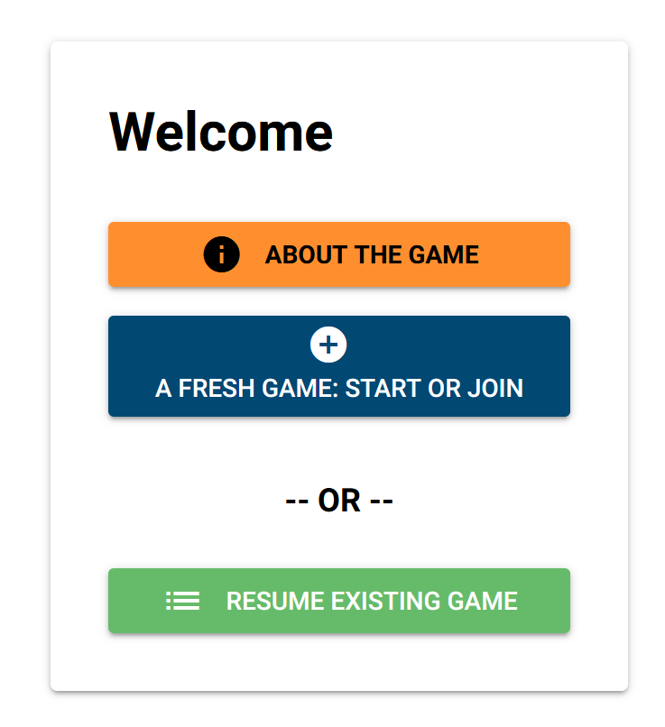
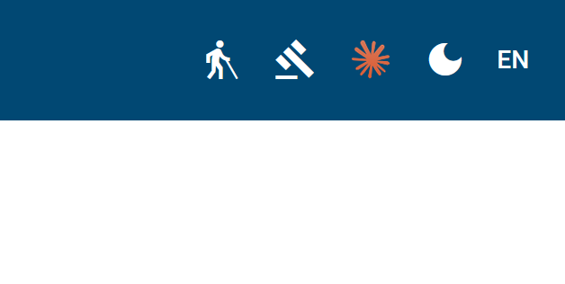

# Gameplay

Enter the following URL with a modern browser:
[https://simfuture.quest/](https://simfuture.quest/)
You will then see this opening screen:

 

in the default language of your browser (if we have translated the app into your language --- if you want to help with the translation, contact us at <simfuture@blue-way.net>. The image adapts automatically to your screen size.

In the top right hand side (may be arranged differently on mobile screens) of your screen are some buttons in your navbar:

 
Clicking on the man with the walking stick gets you to this manual. Clicking on the gavel shows you the legalese related to this website. Clicking on the Claude logo gets you to claude.ai, the ai that helped with user interface, state management coding and VPS deployment. Clicking on the moon (or sun) toggles light and dark mode. And the two-letter button opens the language menu.

From then on, the user interface **should** be self explanatory :) If not, [drop us a line](mailto:simfuture@blue-way.net?subject=Something%20is%20troubling%20me) to let us know what is troubling you.
