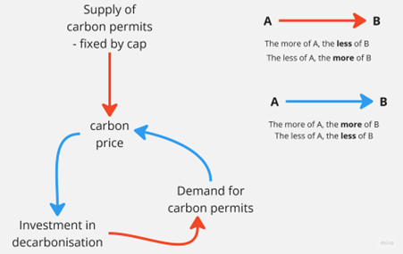
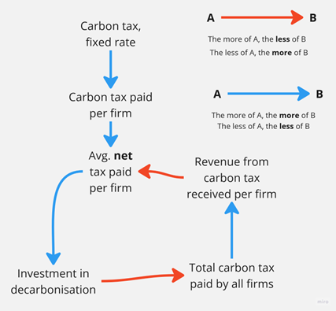

# Exemple : taxe sur le CO₂ vs. système d'échange de quotas d'émission

J'ai vu ce bref exemple des implications politiques de la pensée systémique dans un article de Simon Sharpe intitulé « [Vidéo de présentation](https://www.youtube.com/watch?v=QT1UBrHIB2I) ».

Imagine que tu aies pour mission politique de réduire les émissions de CO₂ dans ton pays et que tu puisses soit mettre en place un système d'échange de quotas d'émission (**échange** de quotas), soit instaurer une taxe sur les émissions de CO₂ dont les recettes seraient redistribuées à tous les émetteurs (**taxe** sur les émissions). Quelle option devrais-tu choisir ?

Dans un article publié sur [Articles du WRI](https://www.wri.org/insights/carbon-tax-vs-cap-and-trade-whats-better-policy-cut-emissions), qui date certes de 2016, Noah Kaufmann déclare : *Les taxes sur le carbone et les programmes de plafonnement et d'échange présentent plusieurs avantages majeurs par rapport aux autres mesures. Tous deux réduisent les émissions en favorisant les réductions les plus rentables, sans que personne n'ait besoin de savoir à l'avance quand et où ces réductions auront lieu. Ces deux mesures encouragent les investisseurs et les entrepreneurs à développer de nouvelles technologies à faible émission de carbone. Et elles génèrent toutes deux des recettes publiques (à condition que les quotas d’émission soient mis aux enchères dans le cadre du système d’échange de quotas) qui peuvent être utilisées de manière productive.*

Et il résume : *Il existe certainement d'autres avantages et inconvénients liés aux taxes sur le CO₂ et aux systèmes d'échange de quotas d'émission que nous n'avons pas abordés.* Néanmoins, comme le dit Jean Tirole, lauréat du prix Nobel d'économie en 2014, ces détails *sont d'une importance secondaire* par rapport à la gestion des risques liés au changement climatique.

Peu importe donc ce que tu choisis ? Eh bien, examinons les répercussions systémiques et dynamiques de ton choix.

### Système de plafonnement et d'échange (commerce)

Dans le système de plafonnement et d'échange, c'est quelqu'un, généralement le gouvernement, qui fixe l'offre de quotas. Plus l'offre est élevée, plus le prix est bas (la flèche rouge ci-dessous). Note aussi : plus l'offre est faible, plus le prix est élevé ; la relation de cause à effet est inverse.

Plus le prix est élevé, plus les investissements dans la décarbonisation sont importants (la flèche **bleue**, qui indique une relation de cause à effet dans le même sens). Plus il y a d'investissements, moins la demande de quotas d'émission est forte ; moins la demande de quotas d'émission est forte, plus le prix est bas : un cercle vertueux. Ou, pour le dire plus simplement : si je fais ce qu'il faut, je **réduis** les incitations pour tous les autres à faire ce qu'il faut.

### Taxe sur le CO₂

Dans le cas d'une taxe sur le CO₂, quelqu'un, généralement le gouvernement, fixe le taux d'imposition (par unité d'émission). Plus le taux d'imposition est élevé, plus la taxe sur le CO₂ payée par une entreprise est élevée. Plus la taxe payée est élevée, plus la charge fiscale nette est élevée. Plus la charge fiscale nette est élevée, plus les investissements dans la décarbonisation sont importants (personne n'aime les impôts :) ). Plus les investissements sont importants, plus la taxe totale payée par l'ensemble des entreprises est faible. Plus la taxe totale est faible, plus le remboursement de la taxe sur le CO₂ accordé à une entreprise individuelle est faible. Plus le remboursement est faible, plus la taxe nette payée est élevée. Plus la taxe nette payée est élevée, plus les investissements dans la décarbonisation sont importants : un cercle vertueux ou, pour le dire plus simplement : si je fais ce qu’il faut, j’**augmente** les incitations pour que tous les autres fassent aussi ce qu’il faut.

### Une comparaison des deux systèmes

Le système de plafonnement et d'échange (cap-and-trade) entraîne une baisse constante du prix des quotas d'émission, ce qui **rend peu attractifs** (c'est-à-dire moins probables) les investissements supplémentaires dans la décarbonisation. La seule façon de mettre fin à cette course à la baisse consiste à réduire le nombre de quotas en circulation, soit régulièrement, soit via un mécanisme (semi-)automatique. Comme les quotas sont des documents papier, il faut mettre en place une bureaucratie chargée de les émettre, de les suivre, de les vérifier et de les retirer de la circulation. 

Une taxe sur le CO₂, en revanche, met en place un système qui incite tous les acteurs concernés à réduire automatiquement leurs émissions jusqu'à ce qu'elles disparaissent complètement.

Alors, qu'est-ce que tu choisirais ?

Si tu ne vois **pas** ce message en anglais et que tu souhaites traduire les mots des images dans ta langue, n'hésite pas à le faire. Envoie-nous le résultat sous forme de fichier *.png à [simfuture@blue-way.net](mailto:simfuture@blue-way.net). Nous saurons apprécier ton travail !
