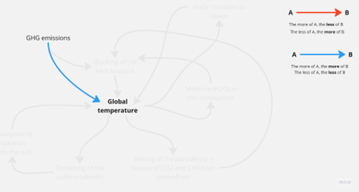
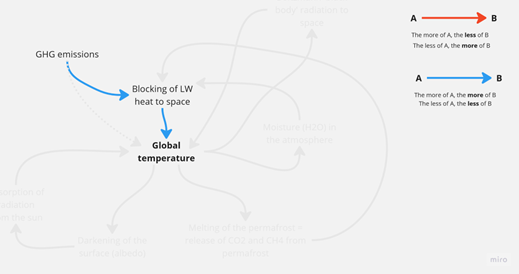
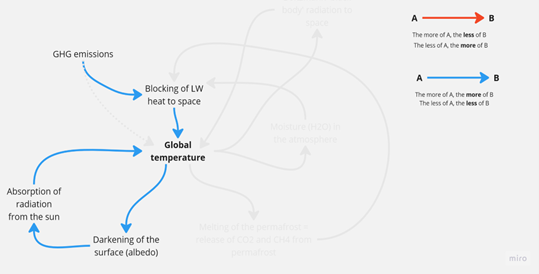
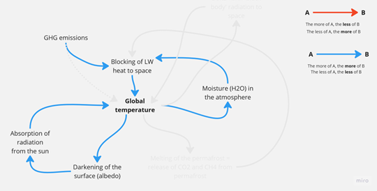
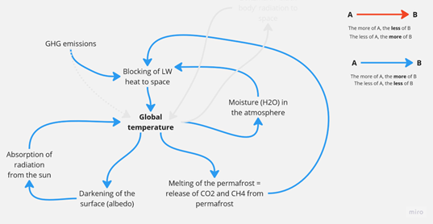
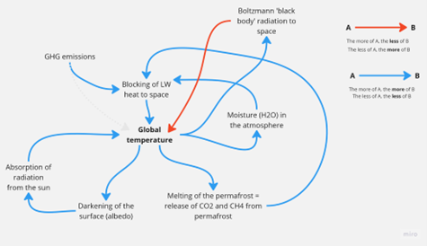

# Émissions et température

Une question revient sans cesse : pourquoi la température reste-t-elle si élevée alors que les émissions ont tant baissé ?
Cette question et cette perplexité découlent d'un modèle de pensée incomplet. La plupart d'entre nous ont appris que ce sont les émissions de gaz à effet de serre qui provoquent la hausse des températures. Ce modèle de cause à effet est désormais si profondément ancré que nous nous battons de toutes nos forces pour atteindre la **neutre carbone**.

  
La réalité physique est toutefois un peu plus complexe. Premièrement, les gaz à effet de serre provoquent une hausse des températures en absorbant la chaleur qui, autrement, s’échapperait dans l’espace, c’est-à-dire qu’ils empêchent une partie de la chaleur (techniquement, une partie du rayonnement à ondes longues (LW)) de s’échapper. Cette distinction sera déterminante plus tard.

  
Et alors, diras-tu peut-être. D'accord, la causalité passe par une variable intermédiaire, mais quand même : moins d'émissions de gaz à effet de serre, moins de blocage, moins de température – toutes les flèches sont bleues.

## Le cycle de l'albédo
C'est vrai, mais la température s'inscrit dans un système physique plus vaste. D'abord, une température plus élevée assombrit la planète, principalement à cause de la fonte des glaces dans les océans et sur les terres. Une planète plus sombre absorbe davantage de rayonnement solaire à ondes courtes, ce qui augmente la température. C'est ce qu'on appelle l'[**Rétroaction de l'albédo**](https://en.wikipedia.org/wiki/Ice%E2%80%93albedo_feedback)
. Une première boucle de rétroaction auto-renforçante (toutes les flèches sont bleues) qui fonctionne indépendamment de toute émission de gaz à effet de serre !

 
## La boucle d'humidité
Deuxièmement, des températures plus élevées permettent à l'atmosphère d'absorber davantage d'humidité. L'humidité, c'est de l'H₂O, un gaz très efficace qui empêche le rayonnement à ondes longues de s'échapper vers l'espace et fait encore monter la température. Un deuxième cycle de rétroaction auto-renforçante (toutes les flèches sont bleues) qui fonctionne indépendamment de toute émission de gaz à effet de serre ! Tu trouveras plus d'infos ici : [La rétroaction de la vapeur d'eau](https://science.nasa.gov/earth/climate-change/steamy-relationships-how-atmospheric-water-vapor-amplifies-earths-greenhouse-effect/)

## Le cycle de fonte du pergélisol
Troisièmement, la hausse des températures entraîne une fonte accrue du pergélisol. Comme le pergélisol est un immense réservoir (~ 1 500 gigatonnes) de CH4 et de CO2, ces gaz sont libérés dans l'atmosphère au fil du temps, ce qui empêche encore plus de rayonnement à ondes longues de s'échapper vers l'espace, ce qui augmente encore davantage la température. Un troisième cycle de rétroaction auto-amplificateur (toutes les flèches sont bleues) qui fonctionne indépendamment de toute émission de gaz à effet de serre ! Jette un œil à l'[Boucle de rétroaction du permafrost à](https://www.esa.int/Applications/Observing_the_Earth/FutureEO/Permafrost_thaw_it_s_complicated).

 
Les trois boucles esquissées ici sont en réalité plus complexes, en particulier le cycle de l'humidité, car il implique les nuages, dont on sait encore très peu de choses, mais la causalité présentée ci-dessus est exacte. Ainsi, même si on atteint l'objectif de zéro émission nette plus vite que prévu, il existe de fortes rétroactions qui maintiennent notre planète à une température plus élevée qu'elle ne l'a été depuis très, très, très longtemps. 

## On vit dans un autre monde, mon pote !
Pourquoi ? Le système climatique n'est plus aujourd'hui ce qu'il était il y a 200 ans, avant la révolution industrielle. Les émissions incessantes de gaz à effet de serre depuis plus de 200 ans ont créé un autre système, dans lequel d'autres boucles de rétroaction déterminent le comportement du système. On pourrait faire l'analogie avec un alcoolique. Après une vie marquée par une consommation excessive d'alcool, son corps n'est plus, physiologiquement, ce qu'il était avant qu'il ne boive son premier verre. Les analystes financiers appellent ça un changement de régime. Les alcooliques appellent ça une addiction.

Est-ce donc trop tard ? Puisque tous les cycles s'autoalimentent ? Et que les cercles vicieux s'intensifient à chaque fois qu'ils se répètent ?

## Le cycle du rayonnement du corps noir
Pas vraiment, car il existe un puissant cycle **d'équilibrage** – là encore, totalement indépendant de ce que nous, les humains, faisons ou ne faisons pas – de la pure physique : [Le système de rayonnement du corps noir de Stefan Boltzmann](https://en.wikipedia.org/wiki/Stefan%E2%80%93Boltzmann_law). En matière d'énergie rayonnante, la planète Terre est un corps noir. Et les corps noirs rayonnent de la chaleur vers l’extérieur (dans le cas de notre planète, vers l’espace), non seulement proportionnellement à leur température, mais proportionnellement à la **quatrième puissance** de leur température. C’est pourquoi ça vaut vraiment la peine de faire tout ce que nous, les humains, pouvons faire pour soutenir cette rétroaction.

 
Si tu ne vois **pas** cela en anglais et que tu souhaites traduire les mots des images dans ta langue, n'hésite pas à le faire. Envoie-nous le résultat sous forme de fichier *.png à [simfuture@blue-way.net](mailto:simfuture@blue-way.net). Nous rendrons hommage à ton travail !
