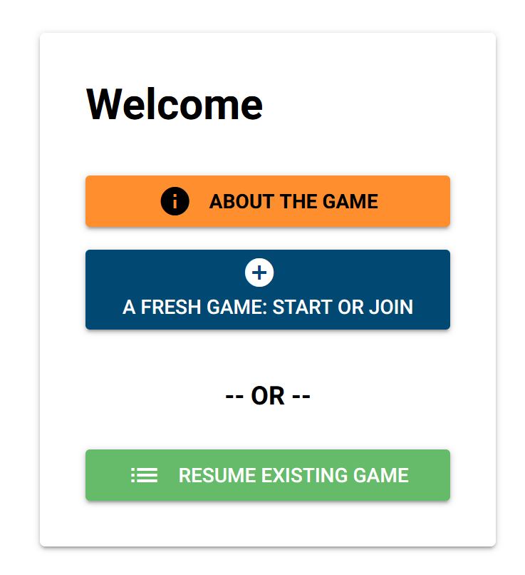
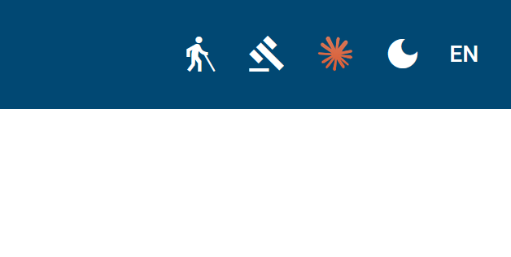

# Déroulement du jeu

Saisis l'URL suivante dans un navigateur moderne :
[https://simfuture.quest/](https://simfuture.quest/)
Tu verras alors s'afficher cet écran d'accueil :

 

dans la langue par défaut de ton navigateur (à condition que nous ayons traduit l'application dans ta langue – si tu souhaites nous aider à la traduire, contacte-nous à l'adresse[simfuture@blue-way.net](mailto:simfuture@blue-way.net)
. L'image s'adapte automatiquement à la taille de ton écran.

En haut à droite de ton écran (la disposition peut varier sur les écrans mobiles), tu trouveras plusieurs boutons dans ta barre de navigation :

 
Si tu cliques sur l'homme à la canne, tu accèderas à ce manuel. Un clic sur le marteau t'affichera les mentions légales de ce site web. Un clic sur le logo Claude te redirige vers claude.ai, l'IA qui a contribué à l'interface utilisateur, au codage de la gestion d'état et au déploiement du VPS. Un clic sur la lune (ou le soleil) permet de basculer entre le mode clair et le mode sombre. Et le bouton avec les deux lettres ouvre le menu des langues.

À partir de là, l'interface devrait être intuitive :) Si ce n'est pas le cas, envoie un e-mail à[écris-nous un e-mail à](mailto:simfuture@blue-way.net?subject=Quelque%20chose%20m%27inqui%C3%A8te)
et dis-nous ce qui te pose problème.
