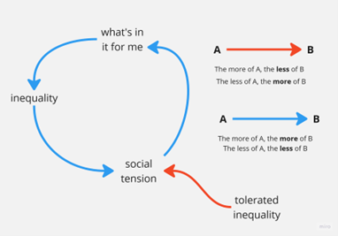

# Inégalités et tensions sociales

Les inégalités croissantes engendrent des tensions sociales. L'ampleur et la rapidité de ce phénomène varient selon les époques et les cultures. D'où la variable « inégalité tolérée ». Mais au final, on ne peut nier que [L'inégalité conduit à des tensions sociales](https://www.bosch-stiftung.de/de/storys/dimensionen-ursachen-und-folgen-von-ungleichheit) - et [ici](https://www.wsi.de/data/wsimit_2018_05_groh-samberg.pdf). Tu trouveras toute la gamme des inégalités sociales sur [ici](https://soztheo.de/soziologie/allgemeine-soziologie/soziale-ungleichheit/)

Dans ce genre de situation, c'est une réaction tout à fait normale pour n'importe quel individu ou groupe de la société de ne penser qu'à soi-même. Chercher à savoir **« Qu'est-ce que j'y gagne ? »** ne fait qu'accroître les inégalités, attiser encore plus les tensions sociales, et ainsi de suite. Il existe de nombreuses expressions familières pour décrire une telle spirale descendante. De l’innocente *« Quand il pleut, c’est le déluge »* à *« [Ce n'est pas un effondrement technologique, c'est le chemin de l'enfer](https://www.youtube.com/watch?v=OcW-BSEB3ng) »*. 

Les cercles vicieux n’ont pas les moyens, par eux-mêmes, de sortir de leur propre cycle. Cette énergie doit venir de l’extérieur : de quelque chose ou de quelqu’un qui lutte contre les inégalités. De quelqu’un ou de quelque chose qui véhicule un objectif ou une vision plus grande que les intérêts particuliers de chacun. Il y a des situations où rien de tout ça ne se produit. Ça mène à l’effondrement et, au mieux, à un « [Reconstruire par pure fatigue](https://www.goodreads.com/book/show/6034091) ». 
 

Si tu remarques que tes joueurs parlent de ce processus de rétroaction ou essaient de le comprendre, demande-leur de donner des exemples personnels où ils se sont eux-mêmes retrouvés dans une telle boucle ou en ont observé d'autres. Demande-leur aussi de citer des exemples tirés de romans ou de films : c'est souvent plus facile que de parler d'expériences personnelles. Demande-leur aussi des exemples d’interventions extérieures visant à briser la causalité descendante de ce cercle vicieux ; que s’est-il passé ? Qui est intervenu ? 

Demande-leur s'ils connaissent une situation sociale où il y a *trop peu d'inégalités*, c'est-à-dire **trop d'égalité**.

Si tu ne vois **pas** ce message en anglais et que tu souhaites traduire les mots des images dans ta langue, n'hésite pas à le faire. Envoie-nous le résultat sous forme de fichier *.png à [simfuture@blue-way.net](mailto:simfuture@blue-way.net). Nous rendrons hommage à ton travail !
