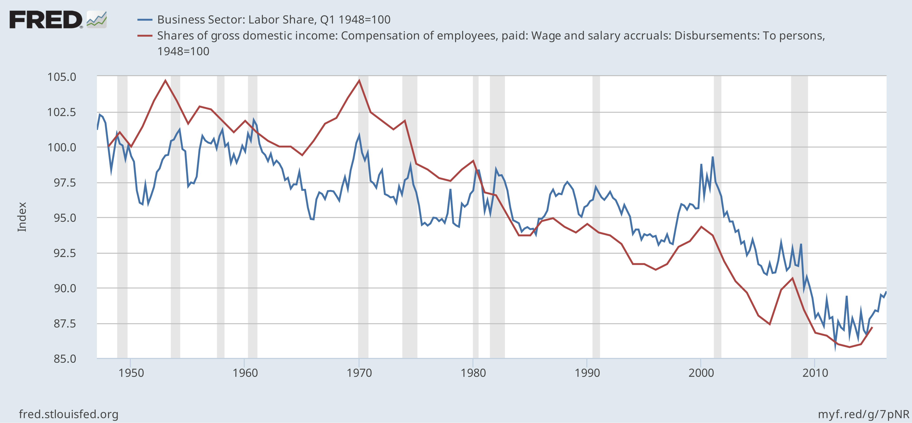
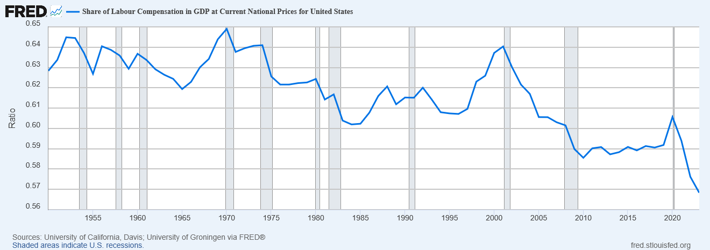

# Réaction des salariés

Dans toute économie, le revenu national est réparti entre les propriétaires et les salariés. Cette répartition résulte de négociations entre les deux parties. Regarde la part qui revient aux salariés (= main-d’œuvre) aux États-Unis. Depuis 1948, cette part n’a cessé de diminuer. 
 
«[La source de cette image est ici](https://en.wikipedia.org/wiki/Labor_share)
». 
Actuellement, la répartition se présente ainsi :

 
La situation est similaire dans d’autres pays. Que te révèlent ces graphiques ?

Tu peux venir en aide aux travailleurs (c'est-à-dire ceux qui ont du mal à joindre les deux bouts) : une autre façon de les aider consiste à **renforcer la réaction des travailleurs** face aux exigences des propriétaires. Cela leur donne plus de pouvoir de négociation face aux propriétaires : ils deviennent plus courageux et plus déterminés. 

La mesure que tu as choisie correspond à une *augmentation* en pourcentage du pouvoir de négociation. 0 laisse tout tel quel, tu ne changes rien. 1 augmente le pouvoir de 1 %, 2 de 2 % et 3 de 3 %. Ça peut sembler peu, mais c'est un début pour s'attaquer à l'[Inégalité](inequality-and-social-tension.md).

Voir aussi[Renforcer les syndicats](strengthen-unions.md)
